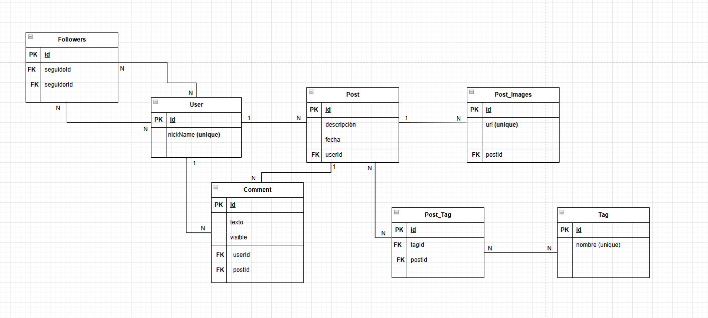

# UnaHur - Red Anti-Social


## 📝 Descripción

Este proyecto es una aplicación web que permite a los usuarios compartir publicaciones con otros. Cada publicación puede tener una **descripción**, **imágenes** y **etiquetas** para clasificar el contenido. Además, otros usuarios pueden dejar **comentarios** en las publicaciones. También pueden seguir y dejar de seguir a múltiples usuarios.



## ⚙️ Tecnologías Utilizadas

Se utilizaron las siguientes tecnologías y herramientas durante el desarrollo:

- **Node.js**  
  Entorno de ejecución para JavaScript del lado del servidor.

- **Express**  
  Framework para crear y organizar las rutas del backend.

- **Sequelize**  
  ORM que permite interactuar con la base de datos usando JavaScript en lugar de SQL directo.

- **SQLite**  
  Base de datos.

- **Joi**  
  Librería para validar los datos que recibe la API y asegurarse de que cumplan con el formato correcto.

- **Swagger**  
  Herramienta para documentar la API de manera visual e interactiva desde el navegador.

- **dotenv**  
  Permite gestionar variables de entorno (como configuraciones del servidor o la base de datos) a través de un archivo `.env`.

- **Nodemon**  
  Utilidad para desarrollo que reinicia automáticamente el servidor cuando se detectan cambios en el código.

---

# Documentación de Entidades

- **User:** Representa a los usuarios del sistema.  
- **Post:** Publicaciones creadas por los usuarios.  
- **Commmet:** Comentarios realizados sobre los posts.  
- **Post_Images:** Imágenes asociadas a un post.  
- **Tag:** Etiquetas para categorizar posts.

---
## Endpoints de la API

La API está organizada por las siguientes rutas:

### **👤 User (Path Base: `/users`)**

* `POST /` : Crea un nuevo Usuario (registro).
* `GET /` : Obtiene la lista de todos los usuarios.
* `GET /:id` : Obtiene un usuario específico.
* `PUT /:id` : Actualiza la información de un usuario.
* `DELETE /:id` : Elimina un usuario.
* `POST /:userId/posts` : Crea un Post asociado al usuario.
* `GET /:userId/posts` : Obtiene todos los Posts creados por el usuario (incluye etiquetas, imagenes y los primeros 3 comentarios).
* `GET /:userId/posts/:postId` : Obtiene un Post específico del usuario.
* `DELETE /:userId/posts/:postId` : Elimina un Post específico del usuario.
* `POST /:userId/posts/:postId/comments` : Crea un Comentario en un Post de un usuario específico.
* `GET /:id/followers` : Obtiene la lista de seguidores del usuario.
* `GET /:id/followed` : Obtiene la lista de usuarios seguidos por el usuario.
* `POST /:idSeguidor/follow/:idSeguido` : El usuario sigue a otro.
* `DELETE /:idSeguidor/unfollow/:idSeguido` : El usuario deja de seguir a otro.
* `GET /:id/followers/count` : Obtiene la cantidad de seguidores.
* `GET /:id/followed/count` : Obtiene la cantidad de seguidos.

---

### **📰 Post (Path Base: `/posts`)**

* `POST /` : Crea una nueva Publicación.
* `GET /` : Obtiene todas las publicaciones
* `GET /:id` : Obtiene una publicación específica.
* `PUT /:id` : Actualiza el contenido de una publicación.
* `DELETE /:id` : Elimina una publicación.
* `GET /:postId/images` : Obtiene las imágenes del post.
* `POST /:postId/images` : Crea una nueva imagen al post.
* `DELETE /:postId/images/:imageId` : Elimina una imagen específica.
* `GET /:postId/tags` : Obtiene las etiquetas asociadas al post.
* `POST /:postId/tags` : Asocia una etiqueta al post.
* `DELETE /:postId/tags/:tagId` : Elimina la asociación de una etiqueta.

---

### **🏷️ Tag (Path Base: `/tags`)**

* `POST /` : Crea una nueva etiqueta.
* `GET /` : Obtiene todas las etiquetas.
* `GET /:id` : Obtiene una etiqueta específica.
* `PUT /:id` : Actualiza el nombre de una etiqueta.
* `DELETE /:id` : Elimina una etiqueta.

---

### **🖼️ Post_Images (Path Base: `/images`)**

* `POST /` : Crea una nueva imagen.
* `GET /` : Obtiene todas las imágenes.
* `GET /:id` : Obtiene una imagen específica.
* `PUT /:id` : Actualiza una imagen específica.
* `DELETE /:id` : Elimina una imagen.

---

### **💬 Comment (Path Base: `/comments`)**

* `POST /` : Crea un nuevo comentario.
* `GET /` : Obtiene todos los comentarios.
* `GET /:id` : Obtiene un comentario específico.
* `PUT /:id` : Actualiza un comentario específico.
* `DELETE /:id` : Elimina un comentario.

---
## 🛠️ Configuración e Instalación

Esta sección detalla los pasos necesarios para configurar y ejecutar el proyecto localmente.

### **Pasos para la Instalación**

1.  **Instalar dependencias:**
    ```bash
    npm install
    ```

3.  **Configurar variables de entorno:**
    Crear un archivo llamado `.env` en la raíz del proyecto para definir las configuraciones.

    **Ejemplo de configuración (usando SQLite por defecto):**

    ```env
    # Configuración del Servidor
    PORT=3000
    
    # Configuración de Reglas de Negocio
    # Antigüedad máxima de un comentario en meses para que sea visible (ej. 3 meses)
    VISIBLE_COMMENTS_MONTHS=3 
    
    # Configuración de la Base de Datos (para Sequelize)
    # Ejemplo usando SQLite:
    DB_DIALECT=sqlite
    DB_STORAGE=. data/data.db
    ```

    *Nota: Si se cambia el `DB_Dialect`, se deben configurar las variables de conexión (`DB_User`, `DB_Password`, `DB_Name`) necesarias para ese motor de base de datos.*

4.  **Ejecutar el servidor:**

    * **Modo Desarrollo (con Nodemon):**
        ```bash
        npm run dev
        ```

El servidor estará disponible en `http://localhost:[PORT]`.

---
## 📄 Documentación y Pruebas

Para facilitar la interacción y el testeo del sistema, la API está completamente documentada y se proporcionan colecciones de prueba.

### **Swagger - Documentación de la API**

La documentación completa e interactiva de la API, generada con **Swagger** (a partir de un archivo en formato YAML), está disponible en el siguiente *path* cuando el servidor está en ejecución:

`http://localhost:[PORT]/api-docs`

Desde esta interfaz, es posible ver todos los *schemas* de datos y entender los códigos de respuesta.

### **Colecciones de Prueba (Postman)**

Se recomienda utilizar las colecciones de prueba incluidas en el repositorio  `./docs/colecciones`. Estas colecciones contienen ejemplos preconfigurados para realizar pruebas de:

1.  **CRUD completo** de todas las entidades.
2.  **Validaciones** de datos.
3.  Pruebas de las **asociaciones** (crear posts con tags, añadir imágenes, etc.).

---
## ⚖️ Reglas de Negocio y Lógica Implementada

Para cumplir con los requisitos del proyecto, se implementaron las siguientes lógicas:

### **Visibilidad**
* **Comentarios:** Los comentarios se filtran automáticamente al obtener un Post. Solo se muestran aquellos donde la fecha de creación es **más reciente** que el valor configurado en `VISIBLE_COMMENTS_MONTHS`.
### **Integridad de Datos (Claves Únicas)**

Se definió una restricción de unicidad para los siguientes campos para evitar duplicados:
* **User:** `nickName` (debe ser único por requisito de negocio).
* **Tag:** `nombre` (evita la creación de etiquetas iguales).
* **Post_Images:** `url` (asegura que la URL de la imagen sea única).
